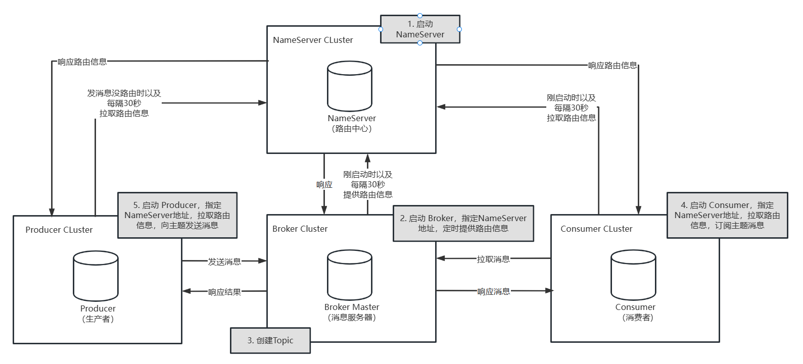
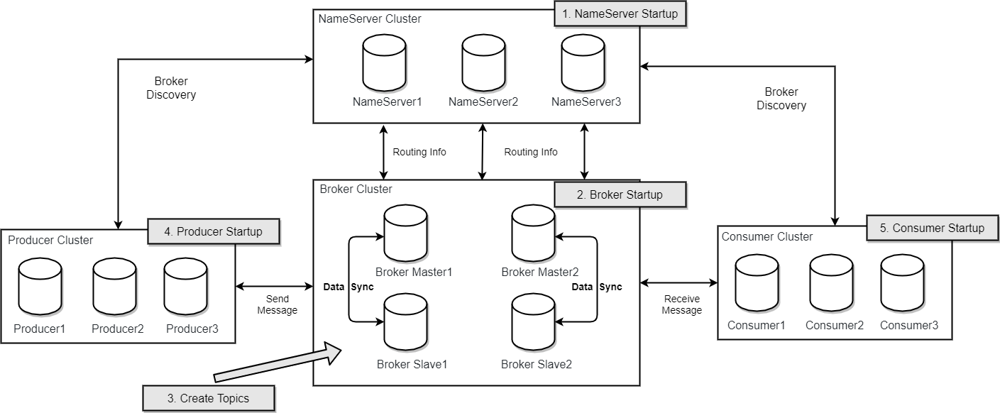
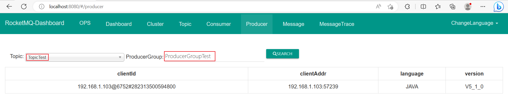
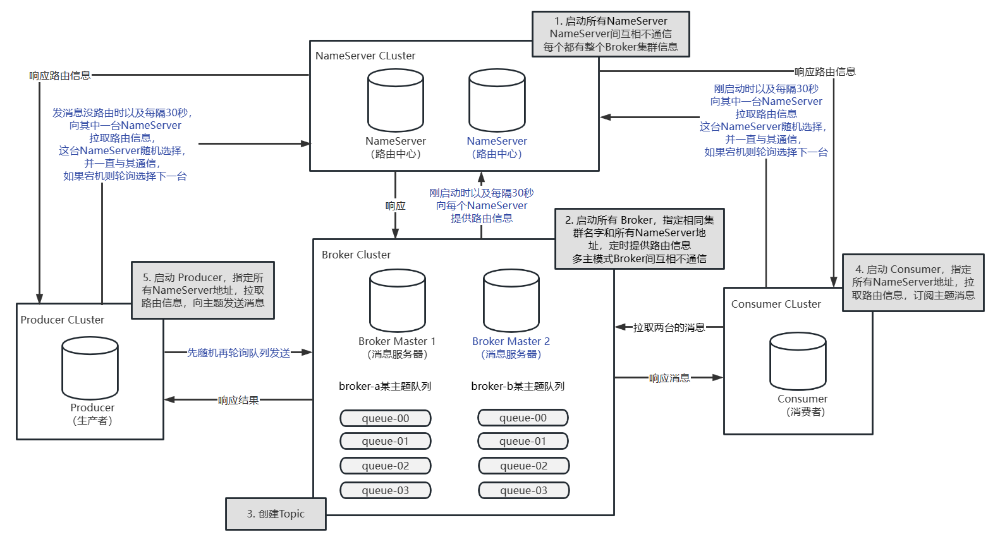
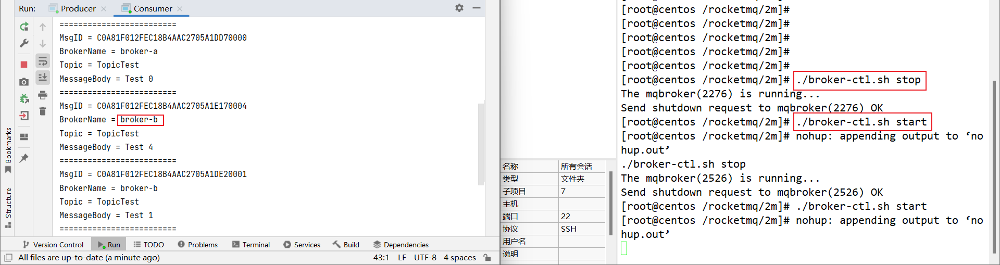
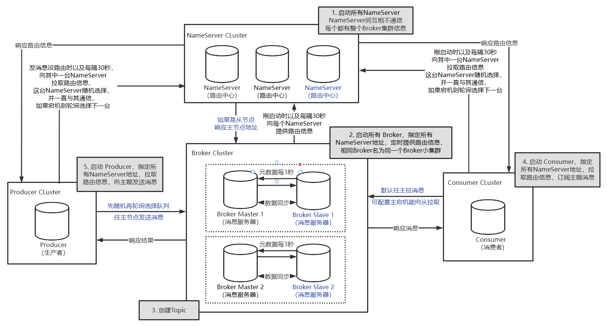
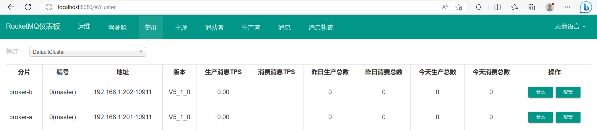
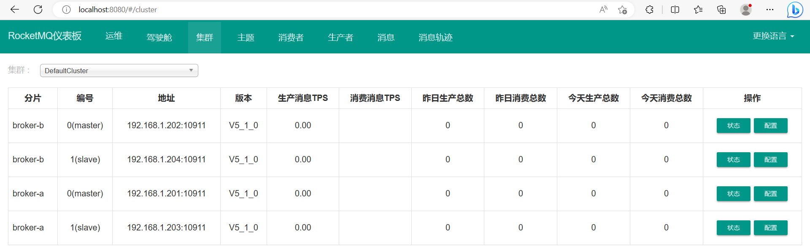
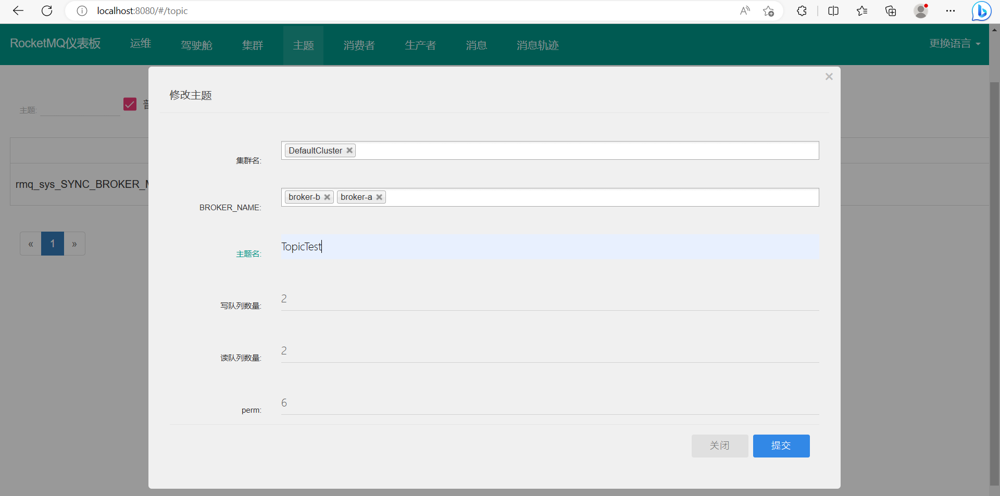
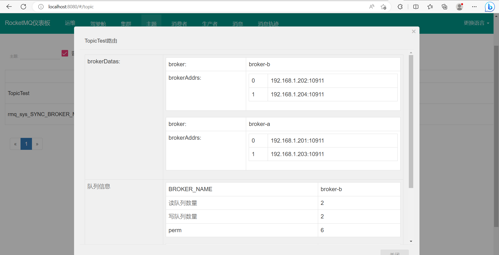

# RocketMQ 常用集群搭建

> https://rocketmq.apache.org/zh/

## 第1章 单主模式 RocketMQ

### 一. 介绍单主模式架构



> 注：官方架构图
>
> https://rocketmq.apache.org/zh/version
>
> 或源码 docs
>
> 

> 注：
>
> 1. Broker 启动时以及每隔30秒向NameServer提供路由信息 源码位置 
>
>    org.apache.rocketmq.broker.BrokerController#start
>
> 2. Consumer 启动时以及每隔30秒向NameServer拉取路由信息 源码位置 
>
>    org.apache.rocketmq.client.impl.consumer.DefaultMQPushConsumerImpl#updateTopicSubscribeInfoWhenSubscriptionChanged
>
>    org.apache.rocketmq.client.impl.factory.MQClientInstance#startScheduledTask
>
> 3. Producer 发送消息没路由时以及每隔30秒向NameServer拉取路由信息 源码位置 
>
>    org.apache.rocketmq.client.impl.producer.DefaultMQProducerImpl#tryToFindTopicPublishInfo
>
>    org.apache.rocketmq.client.impl.factory.MQClientInstance#startScheduledTask

>注：
>
>三种消息生产沟通模式 SYNC、ASYNC、ONEWAY
>
>三种消息者类型      PushConsumer 、SimpleConsumer 和 PullConsumer

### 二. 下载安装 JDK

https://rocketmq.apache.org/zh/docs/quickStart/01quickstart/

> 介绍服务器
>
> 192.168.1.201
>
> 192.168.1.202
>
> 192.168.1.203
>
> 192.168.1.204

下载安装

https://www.oracle.com/java/

https://www.oracle.com/java/technologies/javase/javase8u211-later-archive-downloads.html

```sh
$ mkdir /rocketmq && cd /rocketmq
$ rz
$ tar -zxvf jdk-8u351-linux-x64.tar.gz
```

配置环境变量

```sh
$ vim /etc/profile
export JAVA_HOME="/rocketmq/jdk1.8.0_351"
export PATH="$PATH:$JAVA_HOME/bin"
$ source /etc/profile
```

测试

```sh
$ java -version
java version "1.8.0_351"
Java(TM) SE Runtime Environment (build 1.8.0_351-b10)
Java HotSpot(TM) 64-Bit Server VM (build 25.351-b10, mixed mode)
```

### 三. 下载安装 RocketMQ

> https://rocketmq.apache.org/zh/docs/quickStart/01quickstart/

下载安装

https://rocketmq.apache.org/download

```sh
$ cd /rocketmq
$ rz
$ unzip rocketmq-all-5.1.0-bin-release.zip
```

配置环境变量

```sh
$ vim /etc/profile
export ROCKETMQ_HOME="/rocketmq/rocketmq-all-5.1.0-bin-release"
$ source /etc/profile
```

测试

```sh
$ sh $ROCKETMQ_HOME/bin/mqnamesrv -h
Java HotSpot(TM) 64-Bit Server VM warning: Using the DefNew young collector with the CMS collector is deprecated and will likely be removed in a future release
Java HotSpot(TM) 64-Bit Server VM warning: UseCMSCompactAtFullCollection is deprecated and will likely be removed in a future release.
15:22:08,150 |-INFO in org.apache.rocketmq.logging.ch.qos.logback.classic.LoggerContext[default] - This is logback-classic version 1.3.5-rocketmq
15:22:08,220 |-INFO in org.apache.rocketmq.logging.ch.qos.logback.classic.LoggerContext[default] - Found resource [/rocketmq/rocketmq-all-5.1.0-bin-release/conf/rmq.namesrv.logback.xml] at [file:/rocketmq/rocketmq-all-5.1.0-bin-release/conf/rmq.namesrv.logback.xml]
...
usage: mqnamesrv [-c <arg>] [-h] [-n <arg>] [-p]
 -c,--configFile <arg>    Name server config properties file
 -h,--help                Print help
 -n,--namesrvAddr <arg>   Name server address list, eg: '192.168.0.1:9876;192.168.0.2:9876'
 -p,--printConfigItem     Print all config items
```

> 注：logback 初始化信息，如果不输出，应该可以更简洁。

>注：
>
>Def New young collector - default new generation cllector 默认的新生代垃圾收集器
>
>CMS GC                  - concurrent mark-sweep garbage collector 并发的标记清除垃圾回收器
>
>Par New GC              - parallel young generation garbage collector 并行的新生代垃圾回收器
>
>FullCollection          - Full GC 全面的垃圾回收
>
>Compact                 - 压缩

>注：
>
>concurrent 并发 - two queues one coffee machine
>
>parallel   并行 - two queues two coffee machines
>
>```sh
>$ vim App.java
>public class Main {
>    public static void main(String[] args) {}
>}
>$ javac App.java
>$ java -XX:+UseConcMarkSweepGC -XX:+UseCMSCompactAtFullCollection -XX:-UseParNewGC App
>Java HotSpot(TM) 64-Bit Server VM warning: Using the DefNew young collector with the CMS collector is deprecated and will likely be removed in a future release
>Java HotSpot(TM) 64-Bit Server VM warning: UseCMSCompactAtFullCollection is deprecated and will likely be removed in a future release.
>```

### 四. 演示启动内存不足

> https://rocketmq.apache.org/zh/docs/quickStart/01quickstart/

>```sh
>$ htop
>$ sh $ROCKETMQ_HOME/bin/mqnamesrv
>The Name Server boot success. serializeType=JSON, address 0.0.0.0:9876
>$ sh $ROCKETMQ_HOME/bin/mqbroker -n localhost:9876
>Java HotSpot(TM) 64-Bit Server VM warning: INFO: os::commit_memory(0x00000005c0000000, 8589934592, 0) failed; error='Cannot allocate /ˈæl.ə.keɪt/ memory' (errno=12)
>#
># There is insufficient (/ˌɪn.səˈfɪʃ.ənt/ not enough 不够的) memory for the Java Runtime Environment to continue.
># Native memory allocation (mmap) failed to map 8589934592 bytes for committing reserved memory.
># An error report file with more information is saved as:
># /.../hs_err_pid2752.log
>```

### 五. 修改 JVM 内存参数

调整 -Xms -Xmx -Xmn -XX:MaxDirectMemorySize

```sh
$ vim $ROCKETMQ_HOME/bin/mqnamesrv
$ vim $ROCKETMQ_HOME/bin/mqbroker
```

https://www.oracle.com/java/

https://docs.oracle.com/javase/8/docs/technotes/tools/unix/java.html#BGBCIEFC

> 两张图

```sh
$ vim $ROCKETMQ_HOME/bin/runserver.sh
-Xms256m -Xmx256m -Xmn128m
$ vim $ROCKETMQ_HOME/bin/runbroker.sh
-Xms256m -Xmx256m
-XX:MaxDirectMemorySize=256m
```

测试

```sh
$ sh $ROCKETMQ_HOME/bin/mqnamesrv
The Name Server boot success. serializeType=JSON, address 0.0.0.0:9876
$ sh $ROCKETMQ_HOME/bin/mqbroker -n localhost:9876
The broker[centos, 192.168.1.201:10911] boot success. serializeType=JSON and name server is localhost:9876
$ htop
```

> ```sh
> $ vim test.sh
> #!/bin/bash
> echo $# $0 $1 $2 $3
> echo -------------
> shift
> echo $# $0 $1 $2 $3
> shift
> echo $# $0 $1 $2 $3
> shift
> echo $# $0 $1 $2 $3
> $ sh test.sh arg1 arg2 arg3
> 3 test.sh arg1 arg2 arg3
> -------------
> 2 test.sh arg2 arg3
> 1 test.sh arg3
> 0 test.sh
> ```

### 六. 介绍 nohup 和 SIGHUP

> https://rocketmq.apache.org/zh/docs/quickStart/01quickstart/

测试会话关闭，程序也会关闭

```sh
$ vim test.sh
#!/bin/bash
while true  
do 
    echo "I'm running..." 
    sleep 5s
done
$ sh test.sh
$ sh test.sh &
另一个会话
$ ps -ef | grep test.sh
关闭之前会话
$ ps -ef | grep test.sh
```

测试 使用 nohup 忽略 SIGHUP 信号

```sh
$ nohup test.sh &
另一个会话
$ ps -ef | grep test.sh
关闭之前会话
$ ps -ef | grep test.sh
```

测试 使用 trap 自定义 SIGHUP 信号处理方式

```sh
$ vim test.sh
...
trap "echo I received a SIGHUP signal > trap.log" SIGHUP
...
$ test.sh &
另一个会话
$ ps -ef | grep test.sh
关闭之前会话
$ ps -ef | grep test.sh
$ cat trap.log
I received a SIGHUP signal
```

由于 NameServer 和 Broker 没有忽略 SIGHUP 信号，所以需要使用 nohup 命令来运行，避免关闭会话后，服务也关掉了。

### 七. 启动和关闭 NameServer

> https://rocketmq.apache.org/zh/docs/quickStart/01quickstart/

检查 家目录

```sh
$ ls /root
```

启动 Nameserver

```sh
$ cd $ROCKETMQ_HOME
$ nohup sh bin/mqnamesrv &
$ ls /root
$ tail -f ~/logs/rocketmqlogs/namesrv.log
The Name Server boot success...
```

关闭 Nameserver

```sh
$ sh bin/mqshutdown namesrv
```

### 八. 修改 NameServer 日志位置

把日志写到 m1

```sh
$ cd /rocketmq && mkdir m1 && cd m1
$ export JAVA_OPT="-Duser.home=`pwd`"
$ echo $JAVA_OPT
$ ls
$ nohup sh $ROCKETMQ_HOME/bin/mqnamesrv &
$ ls
$ tail -f logs/rocketmqlogs/namesrv.log
```

### 九. 编写启动和关闭 NameServer 脚本

```sh
$ vim ./namesrv-ctl.sh
#!/bin/bash

case $1 in
    start)
        export JAVA_OPT="-Duser.home=`pwd`"
        nohup sh $ROCKETMQ_HOME/bin/mqnamesrv &
        ;;
    stop)
        sh $ROCKETMQ_HOME/bin/mqshutdown namesrv
        ;;
    *)
        echo "Usage: namesrv-ctl.sh start | stop"
        ;;
esac
$ chmod +x namesrv-ctl.sh
```

测试

```sh
$ jps
2011 Jps
$ ./namesrv-ctl.sh 
Usage: namesrv-ctl.sh start | stop
$ ./namesrv-ctl.sh start
$ jps
2082 NamesrvStartup
2111 Jps
$ ./namesrv-ctl.sh stop
The mqnamesrv(2082) is running...
Send shutdown request to mqnamesrv(1951) OK
```

### 十. 编写启动和关闭 Broker 脚本

> https://rocketmq.apache.org/zh/docs/quickStart/01quickstart/

先启动 NameServer

```sh
$ ./namesrv-ctl.sh start
```

先前台运行测试 Broker

```sh
$ ./mqborker -h
usage: mqbroker [-c <arg>] [-h] [-m] [-n <arg>] [-p]
 -c,--configFile <arg>       Broker config properties file
 -h,--help                   Print help
 -m,--printImportantConfig   Print important config item
 -n,--namesrvAddr <arg>      Name server address list, eg: '192.168.0.1:9876;192.168.0.2:9876'
 -p,--printConfigItem        Print all config item
$ ls /root
$ ./mqbroker -n localhost:9876
The broker[centos, 192.168.1.201:10911] boot success. serializeType=JSON and name server is localhost:9876
$ ls /root
```

编写启动和关闭脚本

```sh
$ vim ./broker-ctl.sh
#!/bin/bash

case $1 in
    start)
        export JAVA_OPT="-Duser.home=`pwd`"
        nohup sh $ROCKETMQ_HOME/bin/mqbroker -n localhost:9876 &
        ;;
    stop)
        sh $ROCKETMQ_HOME/bin/mqshutdown broker
        ;;
    *)
        echo "Usage: broker-ctl.sh start | stop"
        ;;
esac
$ chmod +x broker-ctl.sh
```

测试

```sh
$ jps
$ ./broker-ctl.sh 
Usage: broker-ctl.sh start | stop
$ ./broker-ctl.sh start
$ jps
$ ./broker-ctl.sh stop
$ jps
```

### 十一. 搭建可视化控制台

https://rocketmq.apache.org/zh/download

修改 

```text
File -> Project Structure -> Prject -> SDK 
java 1.8
```

修改

```text
rocketmq.config.namesrvAddr=192.168.1.201:9876
```

### 十二. 测试消息生产

https://rocketmq.apache.org/zh/docs/quickStart/01quickstart/#4-%E5%B7%A5%E5%85%B7%E6%B5%8B%E8%AF%95%E6%B6%88%E6%81%AF%E6%94%B6%E5%8F%91

使用源码例子 演示 生产和消费消息

控制台 Broker 配置 autoCreateTopicEnable=True

修改 SDK

```
File -> Project Structure -> Prject -> SDK 
java 1.8
```

修改 Producer

```sh
public static final int MESSAGE_COUNT = 3;
public static final String PRODUCER_GROUP = "ProducerGroupTest";
public static final String DEFAULT_NAMESRVADDR = "192.168.1.201:9876";
public static final String TOPIC = "TopicTest";
public static final String TAG = "";

// producer.shutdown();
```

检查控制台主题

运行 Producer

检查控制台主题、消息、生产者



### 十三. 测试消息消费

修改 Consumer

```
public static final String DEFAULT_NAMESRVADDR = "192.168.1.201:9876";
public static final String CONSUMER_GROUP = "ConsumerGroupTest";
consumer.setNamesrvAddr(DEFAULT_NAMESRVADDR);

consumer.registerMessageListener((MessageListenerConcurrently) (msgs, context) -> {
    // System.out.printf("%s Receive New Messages: %s %n", Thread.currentThread().getName(), msg);
    for (MessageExt msg : msgs) {
        System.out.println("=========================" + "\n" +
                           "MsgID = " + msg.getMsgId() + "\n" +
                           "Topic = " + msg.getTopic() + "\n" +
                           "MessageBody = " + new String(msg.getBody()));
    }
    return ConsumeConcurrentlyStatus.CONSUME_SUCCESS;
});
```

运行 Consumer

检查控制台消费者

关闭 NameServer 和 Broker

https://rocketmq.apache.org/zh/docs/quickStart/01quickstart/#6-%E5%85%B3%E9%97%AD%E6%9C%8D%E5%8A%A1%E5%99%A8

```sh
$ jps
$ ./broker-ctl.sh stop
$ ./namesrv-ctl.sh stop
$ jps
```

## 第2章 多主模式 RocketMQ

### 一. 介绍多主模式架构



>注：官方架构图
>
>或源码 docs
>
>

> 注：
>
> Broker 向`每个`NameServer提供路由信息 源码位置 
>
> org.apache.rocketmq.broker.out.BrokerOuterAPI#registerBrokerAll
>
> 客户端`随机`选择某个NameServer，并一直与其通信，如果该NameServer宕机，则轮询选择下一台NameServer进行通信 源码位置 
>
> org.apache.rocketmq.remoting.netty.NettyRemotingClient#namesrvIndex
>
> org.apache.rocketmq.remoting.netty.NettyRemotingClient#namesrvAddrChoosed
>
> org.apache.rocketmq.remoting.netty.NettyRemotingClient#getAndCreateNameserverChannel
>
> 客户端 先随机再轮询队列发送消息 源码位置
>
> org.apache.rocketmq.client.impl.producer.TopicPublishInfo#selectOneMessageQueue
>
> org.apache.rocketmq.client.common.ThreadLocalIndex#incrementAndGet

### 二. 介绍多主模式的 Broker 配置

> 修改 201 的 m1 为 1m，参考官方命名
>
> ```sh
> $ mv m1 1m
> ```
>
> 准备 202 环境
>
> ```sh
> $ scp -rq root@192.168.1.201:/rocketmq /
> 或者
> $ mkdir /rocketmq && scp -rq root@192.168.1.201:/rocketmq/* /rocketmq
> 环境变量
> $ scp -q root@192.168.1.201:/etc/profile /etc/profile
> $ source /etc/profile
> ```

```properties
# 集群名              相同的集群名的Broker在同一个集群
brokerClusterName=DefaultCluster
# Broker 名          区分不同的Broker
brokerName=broker-a (broker-b, broker-c, etc.)
# Broker ID          0 表示Master 大于0 表示Slave
brokerId=0
# 删除过期文件时间      每天凌晨四点 此时用户活跃度低，机器资源充足
deleteWhen=04
# 文件保留时间         48天
fileReservedTime=48
# Broker 角色           
# SYNC_MASTER        主节点 主从复制为同步复制
# ASYNC_MASTER       主节点 主从复制为异步复制
# SLAVE              从节点
brokerRole=ASYNC_MASTER
# 刷盘类型             
# SYNC_FLUSH         同步刷盘 性能相对较低，延迟相对较高，但理论上能够不丢数据
# ASYNC_FLUSH        异步刷盘 性能高，延迟低，但小概率丢数据   
flushDiskType=ASYNC_FLUSH
```

> 注:
>
> 

> 注：
>
> 涉及主从时候才需要考虑同步复制还是异步复制。
>
> 不丢数据是指，客户端没收到成功响应，说明肯定没落盘成功，那么或往另一个Broker重试发送。

>注：
>Broker Role 源码位置
>org.apache.rocketmq.store.config.BrokerRole
>
>刷盘类型 源码位置
>
>org.apache.rocketmq.store.config.FlushDiskType

### 三. 编写 NameServer 启动和关闭脚本

拷贝单主模式 NameServer 的启动脚本到多主模式

```sh
$ cp -r 1m 2m
$ cd 2m
$ rm -rf logs/ nohup.out store/
```

简单回顾 NameServer 启动脚本

```shell
$ vim namesrv-ctl.sh
```

### 四. 编写 Broker 启动和关闭脚本

查看 Broker 帮助文档

```sh
$ sh $ROCKETMQ_HOME/bin/mqbroker -h
 -c,--configFile <arg>       Broker config properties file
 -m,--printImportantConfig   Print important config item
 -n,--namesrvAddr <arg>      Name server address list, eg: '192.168.0.1:9876;192.168.0.2:9876' (多个NameServer分号分隔)
 -p,--printConfigItem        Print all config item
```

演示使用分号可以依次执行多条命令

```shell
$ echo 123; echo 456
```

修改 Broker 启动脚本

```shell
$ vim broker-ctl.sh
201 修改为
nohup sh $ROCKETMQ_HOME/bin/mqbroker -n "192.168.1.201:9876;192.168.1.202:9876" -c $ROCKETMQ_HOME/conf/2m-noslave/broker-a.properties &
202 修改为 
nohup sh $ROCKETMQ_HOME/bin/mqbroker -n "192.168.1.201:9876;192.168.1.202:9876" -c $ROCKETMQ_HOME/conf/2m-noslave/broker-b.properties &
```

检查配置是否生效

```sh
$ sh $ROCKETMQ_HOME/bin/mqbroker -h
$ sh $ROCKETMQ_HOME/bin/mqbroker -m
2023-03-21 17:32:44 INFO main - namesrvAddr=
2023-03-21 17:29:15 INFO main - fileReservedTime=72 
$ sh $ROCKETMQ_HOME/bin/mqbroker -n "192.168.1.201:9876;192.168.1.202:9876" -c $ROCKETMQ_HOME/conf/2m-noslave/broker-a.properties -m
2023-03-21 17:29:15 INFO main - namesrvAddr=192.168.1.201:9876;192.168.1.202:9876
2023-03-21 17:29:15 INFO main - fileReservedTime=48 (默认72)
```

> 注：`INFO main - brokerConfigPath=`
>
> 不是bug，这是BrokerContainer相关的配置

> 注：https://www.gnu.org/software/bash/manual/bash.html
>
> 分号`;`在Bash中是控制字符(control operator)，可以让多个命令依次执行。
>
> 单引号`'`、双引号`"`引起来的都是字符串，单引号原样保留字符，双引号可以解析$、反引号执行命令`、斜线转移字符等。

### 五. 启动多主模式 NameServer 和 Broker

依次或同时启动两台机器的NameServer，并查看日志namesrv.log

```sh
201 
$ jps
$ ./namesrv-ctl.sh start
$ jps
202
$ jps
$ ./namesrv-ctl.sh start
$ jps
```

指定两台NameServer地址

启动可视化控制台

```properties
rocketmq.config.namesrvAddr=192.168.1.201:9876;192.168.1.202:9876

# 检查启动日志
# [2023-03-21 17:54:59.572]  INFO setNameSrvAddrByProperty nameSrvAddr=192.168.1.201:9876;192.168.1.202:9876
```

观察Cluster

依次启动两台机器的Broker，并查看日志broker.log

```sh
201 
$ jps
$ ./broker-ctl.sh start
$ jps
The broker[broker-a, 192.168.1.201:10911] boot success. serializeType=JSON and name server is 192.168.1.201:9876;192.168.1.202:9876
观察可视化控制台

202
$ jps
$ ./broker-ctl.sh start
$ jps
观察可视化控制台
```


### 六. 测试生产消息和消费消息

> 验证先随机再轮询队列的方式向某个队列生产消息
>
> 验证一个消费者消费所有Broker上的消息

修改 Producer 代码

```java
public static final int MESSAGE_COUNT = 8;
public static final String DEFAULT_NAMESRVADDR = "192.168.1.201:9876;192.168.1.202:9876";
```


查看控制台 集群 观察 负载均衡

今日生产总数 0


运行 Producer 验证 先随机再轮询选择队列生产消息

查看控制台 集群、主题、主题路由、消息


修改 Consumer 代码

```java
public static final String DEFAULT_NAMESRVADDR = "192.168.1.201:9876;192.168.1.202:9876";
for (MessageExt msg : msgs) {
    System.out.println("=========================" + "\n" +
                      "MsgID = " + msg.getMsgId() + "\n" +
                      "BrokerName = " + msg.getBrokerName() + "\n" +
                      "Topic = " + msg.getTopic() + "\n" +
                      "MessageBody = " + new String(msg.getBody()));
}
```

运行 Consumer 验证从 broker-a 和 broker-b 拉取消息


多次运行 Consumer，验证先随机再轮询选择队列

### 七. 演示其中一台 Broker 宕机和修复

1. 演示一台 Broker 宕机，业务能正常发送消息和消费消息

删除 logs nohup.out store，启动 NameServer Borker

可视化控制台 集群 两个 broker

修改 Producer 代码 

```java
public static final int MESSAGE_COUNT = Integer.MAX_VALUE;  // 2,147,483,647 生产21亿多条消息 
// 消息内容改为
"Test "
System.out.printf("%s%n", sendResult);
Thread.sleep(500);
```

启动 Producer 模拟业务一直发送消息

Producer 能一直往 broker-a broker-b 发送消息

启动 Consumer 模拟业务一直消费消息 

Consumer 能一直消费 broker-a broker-b 上的消息


关闭 broker-a 模拟 borker-a 宕机

可视化控制台 集群 只剩下一个 broker


现在 Producer 只会往 broker-b 发送消息

现在 Consumer 只会消费 broker-b 上的消息

虽然 broker-a 宕机了，但业务新的消息发送和消费没有受影响


重启 broker-a 

可视化控制台 集群

业务会再次发送消息到 broker-a ，Consumer 也能继续正常消费 broker-a 的消息


2. 演示可能会出现长时间消息延迟问题

准备测试环境

停掉 Producer，停掉 Consumer，关闭 两台 broker，删除 两台 broker 的 store 文件，重启 两台 broker

修改 Produer 代码

```java
// 两个 Broker 共 8 个队列，每个队列刚好一个消息
public static final int MESSAGE_COUNT = 8;
```

启动 Producer

控制台 集群 

关闭 broker-a，模拟 broker-a 有4条消息未被消费

控制台 集群 只剩下一个 broker


启动 Consumer，broker-b 上的消息被消费完了，broker-a 上堆积的消息没被消费


启动 broker-a，未被消费的消息才能 Consumer 消费 

假设 10分钟后，运维人员才发现 broker-a 宕机了，并将 broker-a 启动，这时候相当于 broker-a 未被消费的消息有10分钟以上的延迟后才被消费





broker-a 启动起来后，问题会自动修复。


总结：相对单主模式，更高可用，但可能会出现长时间消息延迟问题，而且如果机器磁盘彻底损坏，没有数据备份。

## 第3章 多主多从(同步/异步)模式 RocketMQ

### 一. 介绍多主多从模式架构



> 注：官方架构图
>
> 

>注：主宕机自动往从拉去消息，需要配置slaveReadEnable=true，默认false

> 注：
>
> 从节点每3秒向主节点拉取元数据 源码位置
>
> org.apache.rocketmq.broker.BrokerController#initializeBrokerScheduledTasks
>
> 如果是从节点向NameServer提供路由信息，NameServer会响应主节点地址和高可用地址给从节点 源码位置
>
> org.apache.rocketmq.namesrv.routeinfo.RouteInfoManager#registerBroker

### 二. 介绍多主多从模式的 Broker 配置

> 203 204 环境准备
>
> ```shell
> $ mkdir /rocketmq
> $ scp -rq root@192.168.1.201:/rocketmq/* /rocketmq
> $ scp -q root@192.168.1.201:/etc/profile /etc/profile
> $ source /etc/profile
> ```

主节点

```properties
# 集群名              相同的集群名的Broker在同一个集群
brokerClusterName=DefaultCluster
# Broker 名          区分不同的Broker 相同的Broker名属于同一个Broker小集群
brokerName=broker-a (broker-b, broker-c, etc.)
# Broker ID          0 表示Master 大于0 表示Slave
brokerId=0
# 删除过期文件时间      每天凌晨四点 此时用户活跃度低，机器资源充足
deleteWhen=04
# 文件保留时间         48天
fileReservedTime=48
# Broker 角色           
# SYNC_MASTER        主节点 主从复制为同步复制
# ASYNC_MASTER       主节点 主从复制为异步复制
# SLAVE              从节点
brokerRole=ASYNC_MASTER
# 刷盘类型             
# SYNC_FLUSH         同步刷盘 性能高，延迟低，但小概率丢数据   
# ASYNC_FLUSH        异步刷盘 性能相对较低，延迟相对较高，但理论上能够不丢数据
flushDiskType=ASYNC_FLUSH
# 从节点是否可读取消息
slaveReadEnable=true
```

从节点

```properties
# 集群名              相同的集群名的Broker在同一个集群
brokerClusterName=DefaultCluster
# Broker 名          区分不同的Broker 相同的Broker名属于同一个Broker小集群
brokerName=broker-a  (broker-b, broker-c, etc.)
# Broker ID          0 表示Master 大于0 表示Slave
brokerId=1
deleteWhen=04
fileReservedTime=48
# Broker 角色           
# SLAVE              从节点
brokerRole=SLAVE
flushDiskType=ASYNC_FLUSH
# 从节点是否可读取消息
slaveReadEnable=true
```

> 注：
>
> slaveReadEnable必须主从都设置为true，才能从从节点读取消息
>
> 通过`sh $ROCKETMQ_HOME/bin/mqbroker -p | grep slave ` 查看slaveReadEnable配置默认为false，需要设置成true
>
> ```sh
> $ sh $ROCKETMQ_HOME/bin/mqbroker -p | grep slave 
> 2023-04-12 14:57:29 INFO main - slaveReadEnable=false

对比同步复制和异步复制的配置 2m-2s-sync 2m-2s-async

>注：同步复制、异步复制、同步刷盘、异步刷盘
>
>
>
>

### 三. 编写 NameServer 和 Broker 脚本

使用2m-2s-asyn配置

增加slaveReadEnable=true

```sh
# 201 202 203 204
echo "slaveReadEnable=true" >> broker-a.properties
echo "slaveReadEnable=true" >> broker-a-s.properties
echo "slaveReadEnable=true" >> broker-b.properties
echo "slaveReadEnable=true" >> broker-b-s.properties
```

拷贝多主模式的脚本到多主多从模式

```shell
$ cp -r 2m 2m2s
$ cd 2m2s
$ rm -rf logs/ nohup.out store/
```

简单回顾 NameServer 启动脚本

```shell
$ vim namesrv-ctl.sh
```

修改 Broker 启动脚本

```sh
$ vim broker-ctl.sh
201 修改为
nohup sh $ROCKETMQ_HOME/bin/mqbroker -n "192.168.1.201:9876;192.168.1.202:9876;192.168.1.203:9876" -c $ROCKETMQ_HOME/conf/2m-2s-async/broker-a.properties &
202 修改为 
nohup sh $ROCKETMQ_HOME/bin/mqbroker -n "192.168.1.201:9876;192.168.1.202:9876;192.168.1.203:9876" -c $ROCKETMQ_HOME/conf/2m-2s-async/broker-b.properties &
203 修改为
nohup sh $ROCKETMQ_HOME/bin/mqbroker -n "192.168.1.201:9876;192.168.1.202:9876;192.168.1.203:9876" -c $ROCKETMQ_HOME/conf/2m-2s-async/broker-a-s.properties &
204 修改为 
nohup sh $ROCKETMQ_HOME/bin/mqbroker -n "192.168.1.201:9876;192.168.1.202:9876;192.168.1.203:9876" -c $ROCKETMQ_HOME/conf/2m-2s-async/broker-b-s.properties &
```

### 四. 启动多主多从 NameServer 和 Broker

启动 201 202 203 NameServer

```sh
201 202 203
$ jps
$ ./namesrv-ctl.sh start
$ jps
$ tail nohup.out
The Name Server boot success. serializeType=JSON, address 0.0.0.0:9876
```

配置NameServer地址，启动可视化控制台

```properties
rocketmq.config.namesrvAddr=192.168.1.201:9876;192.168.1.202:9876;192.168.1.203:9876

# [2023-03-29 18:08:14.530]  INFO setNameSrvAddrByProperty nameSrvAddr=192.168.1.201:9876;192.168.1.202:9876;192.168.1.203:9876
```

查看集群

启动 201 202 203 204 Broker 

先启动主 查看集群

```sh
201 202 
$ jps
$ ./broker-ctl.sh start
$ jps
$ tail nohup.out
The broker[broker-a, 192.168.1.201:10911] boot success. serializeType=JSON and name server is 192.168.1.201:9876;192.168.1.202:9876;192.168.1.203:9876
```



再启动从 查看集群

```sh
203 204 
$ jps
$ ./broker-ctl.sh start
$ jps
$ tail nohup.out
The broker[broker-a, 192.168.1.203:10911] boot success. serializeType=JSON and name server is 192.168.1.201:9876;192.168.1.202:9876;192.168.1.203:9876
```



### 五. 手动添加消息 Topic



> 注：
>
> 写队列数量、读队列数量只是逻辑队列，实际进行读写的物理队列，取这两个的最大值，这两个逻辑队列数量用于队列的动态扩容缩容
>
> 主题权限 继承1 可读2 可写4 源码位置 org.apache.rocketmq.common.constant.PermName
>
> 可读可写 按位或 2 | 4 = 6 或者 也可使用 2 + 4 = 6

查看Topic路由



### 六. 测试生产消息和消费消息

修改 Producer 代码

```java
public static final int MESSAGE_COUNT = 4;
public static final String PRODUCER_GROUP = "ProducerGroupTest";
public static final String DEFAULT_NAMESRVADDR = "192.168.1.201:9876;192.168.1.202:9876;192.168.1.203:9876";
```

查看控制台 集群 观察 负载均衡

今日生产总数 0

查看四个Broker的commitlog

```sh
201 202 
$ ll -h store/commitlog/
total 0

203 204
$ ll -h store/commitlog/
total 0
-rw-r--r--. 1 root root 1.0G Mar 30 16:21 00000000000000000000
-rw-r--r--. 1 root root 1.0G Mar 30 16:21 00000000001073741824

$ hexdump -h (直接演示hexdump -v)
 -v              display without squeezing similar lines         (squeeze /skwiːz/ verb PRESS TOGETHER)
$ hexdump store/commitlog/00000000000000000000
$ hexdump -v store/commitlog/00000000000000000000
$ hexdump -v store/commitlog/00000000000000000000 > 1.txt
Ctrl+C
$ vim 1.txt (左边第一列，表示第一个字节的索引)
```

运行 Producer 

```
# 先随机后轮询选择队列
SendResult [sendStatus=SEND_OK, msgId=C0A81F0129BC18B4AAC24181D05B0000, offsetMsgId=C0A801CA00002A9F0000000000000000, messageQueue=MessageQueue [topic=TopicTest, brokerName=broker-b, queueId=0], queueOffset=0]
SendResult [sendStatus=SEND_OK, msgId=C0A81F0129BC18B4AAC24181D2A50001, offsetMsgId=C0A801CA00002A9F00000000000000DB, messageQueue=MessageQueue [topic=TopicTest, brokerName=broker-b, queueId=1], queueOffset=0]
SendResult [sendStatus=SEND_OK, msgId=C0A81F0129BC18B4AAC24181D49C0002, offsetMsgId=C0A801C900002A9F0000000000000000, messageQueue=MessageQueue [topic=TopicTest, brokerName=broker-a, queueId=0], queueOffset=0]
SendResult [sendStatus=SEND_OK, msgId=C0A81F0129BC18B4AAC24181D6BC0003, offsetMsgId=C0A801C900002A9F00000000000000DB, messageQueue=MessageQueue [topic=TopicTest, brokerName=broker-a, queueId=1], queueOffset=0]
```

查看控制台 集群

```sh
201 202 203 204
$ ll -h store/commitlog/
total 4.0K
-rw-r--r--. 1 root root 1.0G Mar 30 16:47 00000000000000000000
-rw-r--r--. 1 root root 1.0G Mar 30 16:47 00000000001073741824
$ hexdump -v store/commitlog/00000000000000000000 > 2.txt
Ctrl+C
$ vim 2.txt
0000000 0000 db00 a3da a720 2e00 a3a9 0000 0000
0000010 0000 0000 0000 0000 0000 0000 0000 0000
0000020 0000 0000 0000 0000 0000 8701 b231 7cf5
0000030 a8c0 6601 0000 ccca 0000 8701 b231 b8f4
0000040 a8c0 c901 0000 9f2a 0000 0000 0000 0000
0000050 0000 0000 0000 0600 6554 7473 3220 5409
...
201 203 数据一样 数据同步成功
202 204 数据一样 数据同步成功
201 202 数据不一样，两个不同的Broker小集群，而且存储的消息不一样。
```

> 注：
>
> 从节点提前生成好两个commitlog文件是为了提高性能
>
> consumequeue和index是由commitlog构建出来的消息索引文件

修改 Consumer 代码

```java
public static final String DEFAULT_NAMESRVADDR = "192.168.1.201:9876;192.168.1.202:9876;192.168.1.203:9876";

for (MessageExt msg : msgs) {
    System.out.println("=========================" + "\n" +
                       "MsgID = " + msg.getMsgId() + "\n" +
                       "BrokerName = " + msg.getBrokerName() + "\n" +
                       "Topic = " + msg.getTopic() + "\n" +
                       "QueueId = " + msg.getQueueId() + "\n" +
                       "MessageBody = " + new String(msg.getBody()) + "\n" +
                       "ThreadName = " + Thread.currentThread().getName());
}
```

> 注：RocketMQ 使用一个线程池里面的线程来消费消息，这个线程池最小/最大线程数都为20，也就是固定为20个线程
>
> consumer.setConsumeThreadMin();
> consumer.setConsumeThreadMax();

打印实际向那台 Broker 拉取消息

```java
// 修改 org.apache.rocketmq.client.impl.consumer.PullAPIWrapper#pullKernelImpl
PullMessageRequestHeader requestHeader = new PullMessageRequestHeader();
requestHeader.setConsumerGroup(this.consumerGroup);
requestHeader.setTopic(mq.getTopic());
requestHeader.setQueueId(mq.getQueueId());
// ...

String brokerAddr = findBrokerResult.getBrokerAddr();
// 根类过滤器相关，不管有没走if里面代码，输出最终去那台Broker拉取消息
if (PullSysFlag.hasClassFilterFlag(sysFlagInner)) {
    brokerAddr = computePullFromWhichFilterServer(mq.getTopic(), brokerAddr);
}
// 输出实际向那台Broker拉取消息
System.out.println("向 " + brokerAddr + " 拉取消息" + " [" + Thread.currentThread().getName() + "] ");
```

运行 Consumer

验证正常情况，往主节点拉取消息

> 注：
>
> RebalanceService 线程池 不断往把待发送请求写入 messageRequestQueue 队列，
>
> PullMessageService 线程池 不断读取 messageRequestQueue 队列，然后发送拉取消息请求，拉取回来的消息交给 consumeMessageService 异步处理
>
> consumeMessageService 线程池 消费拉取回来的消息。

### 七. 演示消息队列动态扩容缩容

> 注：
>
> 查看可视化控制台 TopicTest 路由 两个 Broker 各两个队列，共四个队列
>
> 演示动态缩容/扩容示意图
>
> 备份 store 目录


1. 动态缩容

如果直接缩容，消费者没消费完旧队列数据，会导致丢消息。

2. 动态扩容

如果直接扩容，生产者往新队列写数据，消费者没开始消费新队列数据，会导致消息延迟、消息堆积。


修改生产者 

```java
public static final int MESSAGE_COUNT = Integer.MAX_VALUE;  // 2,147,483,647 生产21亿多条消息

System.out.printf("%s%n", sendResult);
Thread.sleep(500);
```

启动消费者、生产者，默认业务一直生产和消费消息 

观察队列ID 

```
# 四个队列 都在使用
broker-a queue-0
broker-a queue-1
broker-b queue-0
broker-b queue-1
```


1. 动态缩容

可视化控制台 修改 TopicTest 写队列数为1 需要分开修改

观察队列ID 

```
# 消费者 只往 broker-a queue-0 broker-b queue-0 发消息
SendResult [sendStatus=SEND_OK, msgId=C0A81F013C9C18B4AAC241A75D23016E, offsetMsgId=C0A801C900002A9F0000000000009F7A, messageQueue=MessageQueue [topic=TopicTest, brokerName=broker-a, queueId=0], queueOffset=94]
SendResult [sendStatus=SEND_OK, msgId=C0A81F013C9C18B4AAC241A75F19016F, offsetMsgId=C0A801CA00002A9F0000000000009F7A, messageQueue=MessageQueue [topic=TopicTest, brokerName=broker-b, queueId=0], queueOffset=95]
```

> 注：按上箭头可以方便观看日志，可视化控制台语言设置为英文

可视化控制台 主题 Consumer管理 确认 broker-a broker-b 第二个队列的数据已全部被消费，diffTotal 为 0，多次查看第二个队列 brokerOffset 不再增加

如果已消费完，修改读队列为1 

可视化控制台 主题 Consumer管理

检查 IDEA 生产者、消费者情况


2. 动态扩容

可视化控制台 修改 TopicTest 读队列为 2 

可视化控制台 主题 Consumer管理 如果出现4个队列，说明消费者已经准备好了，多次查看第二个队列 brokerOffset 不增加

可视化控制台 修改 TopicTest 写队列为 2 

可视化控制台 主题 Consumer管理 查看第二个队列 brokerOffset 开始增加

检查 IDEA 生产者、消费者情况

### 八. 演示其中一台 Broker 宕机和修复

> 注：
>
> 删除 logs nohup.out store
>
> 已增加slaveReadEnable=true配置，默认false，默认不会从从节点拉取消息

1. 演示一台 Broker 宕机，业务能正常发送消息和消费消息

可视化控制台 集群 4台 broker

启动 Producer 模拟业务一直发消息

启动 Consumer 模拟业务一直消费消息

Producer能正常往两台broker发送消息，Consumer能正常往两台broker拉取消息


关闭 broker-a master 模拟 broker-a master 宕机

可视化控制台 集群 3台 broker

IDEA Producer能正常往broker-b发送消息，Consumer能正常往broker-b拉取消息，业务没有受影响


启动 broker-a master 模拟 borker-a master 恢复

可视化控制台 集群 4台 broker

Producer能正常往两台broker发送消息，Consumer能正常往两台broker拉取消息


2. 演示一台 Broker 宕机了，消息消费没有长时间延迟的问题

> 验证消息不会被重复消费

停掉 Producer Consumer，关闭四台 Broker，删除 store 目录，启动四台 Broker


模拟消息堆积

```java
public static final int MESSAGE_COUNT = 8;
```

运行 Producer

可视化控制台 集群

关闭 broker-a master 模拟 broker-a master 宕机，并有四条消息未消费


启动消费者，向203和202拉取消息，消费了8条消息，没有消息延迟或堆积的问题

可视化控制台 集群


启动 broker-a master，模拟 broker-a master 已恢复

观察 可视化控制台

观察消费者，开始从 201 和 202 拉取消息，另外不会从 201 重复拉取已在 203 拉取过的消息，自动避免重复消费


修改生产者

```java
public static final int MESSAGE_COUNT = Integer.MAX_VALUE; 
```

重启 Producer 模拟业务继续生产消息

Producer 能正常向两台 broker 发送消息，主要是 broker-a

Consumer 能继续从 broker-a master 拉取消息


总结：多主多从模式，高可用，如果一台 broker 宕机，没有消息长时间延迟问题，而且如果一台 broker 磁盘完全损坏，副本节点有数据备份。
