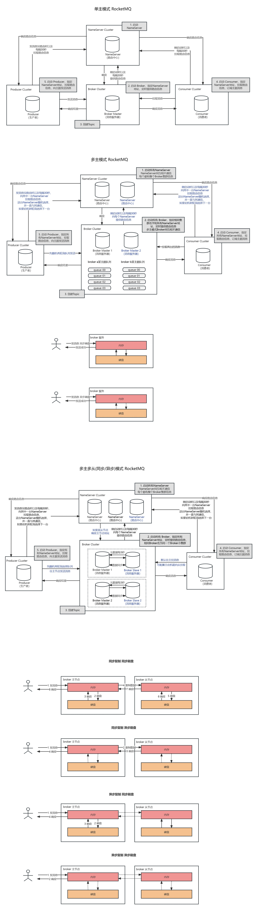

# RocketMQ 常用集群搭建

## 课程介绍

RocketMQ 是由阿里捐赠给 Apache 的一款低延迟、高并发、高可用、高可靠的分布式消息中间件。经历了淘宝双十一的洗礼。RocketMQ 既可为分布式应用系统提供异步解耦和削峰填谷的能力，同时也具备互联网应用所需的海量消息堆积、高吞吐、可靠重试等特性。

本课程将带大家搭建单主、多主以及多主多从模式的 RocketMQ 集群

## 备注

课程笔记等内容，在课程资料里面。

